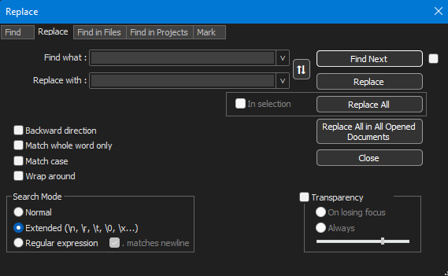

# How to format NetworkX cytoscape_data to Cytoscape compliant JSON with fixed node locations using Notepad++'s Find & Replace tool
- The generated Cytoscape representation from NetworkX graphs is not directly compatible with Cytoscape and needs a series of modifications before it can be imported.
- Editing of the generated Cytoscape representation (JSON) is done in Notepad++'s Find and Replace tool (CTRL + F, CMD + F) 

- The steps outlined below transforms the Cytoscape representation into a format that is compatible with Cytoscape.
- This process makes sure that the biochemical coordinate layout from the graph it represents is available.
- This is possible by separating the biochemical coordinates from the graph into two separate JSON fields:
  - X-coordinates: "x"
  - Y-coordinates: "y"
- Several other modifications are made to the Cytoscape representation to make it compatible with Cytoscape:
  - Single quotes are replaced with double quotes
  - boolean "False" & "True" are replaced with "false" & "true"

## Step 1 - Replace single quoation marks with doubles

Find what: '
Replace with: "

## Step 2 - Separate x & y coordinate fields

- Find what:., 
- Replace with:,\n"y":

- Find what:"pos": array([
- Replace with: "x":

- Find what:.])
- Replace with:

- Find what:. ,
- Replace with:.,

- Find what:.,
- Replace with:,

- Find what:, 
- Replace with:,\n\t"y":

- Find what:_c", 
- Replace with:_c",\n\t

- Find what:_e", 
- Replace with:e",\n\t

- Find what:.,
- Replace with:,

- Find what:, 
- Replace with:,\n\t"y":

- Find what:. ,
- Replace with:,

## Step 3 - lowercase booleans

- Find what:True
- Replace with:true

- Find what:False
- Replace with:false