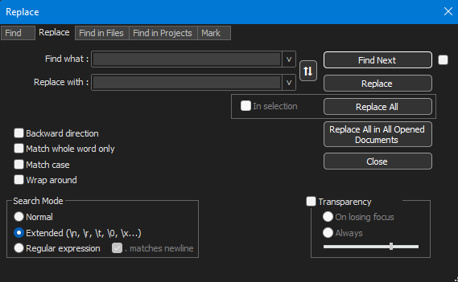

# How to format NetworkX graphs to Cytoscape compliant JSON with fixed node locations using Notepad++'s Replace tool
- The generated NetworkX graphs exported to Cytoscape format using the function "networkx.cytoscape_data(G)" is not directly compatible with Cytoscape and needs a series of modifications before it can be imported and visualized in Cytoscape.
- This process can be validated by using the "E_coli_core _DEMO.json" file provided in this repository and should be identical with the file "E_coli_core_formatted.json".
- Editing of the generated graphs in Cytoscape JSON is done in Notepad++'s Replace tool (CTRL + F, CMD + F) with the settings displayed in the image below.

- The steps outlined below transforms the Cytoscape JSON generated by NetworkX so it is compatible with Cytoscape.
- This process makes sure that the biochemical coordinate layout from the graph is available to be used by VizMapper in Cytoscape.
- This is possible by separating the biochemical coordinates from the graph into two separate JSON fields:
  - X-coordinates: "x"
  - Y-coordinates: "y"
- Several other modifications are made to the Cytoscape representation to make it compatible with Cytoscape:
  - Single quotes are replaced with double quotes
  - boolean "False" & "True" are replaced with "false" & "true"
  - NB: If loading the network in cytoscape without x- and y-coordinates only step 1 and 3 is required. This will result in the network will be displayed in a random arrangement.

&nbsp;

## Step 1 - Replace single quoation marks with doubles

&nbsp;

- Find what: '
- Replace with: "

&nbsp;

## Step 2 - Create and separate x & y coordinate fields

&nbsp;

- Find what:., 
- Replace with:,\n"y":

&nbsp;

- Find what:"pos": array([
- Replace with: "x":

&nbsp;

- Find what:.])
- Replace with:

&nbsp;

- Find what:. ,
- Replace with:.,

&nbsp;

- Find what:.,
- Replace with:,

&nbsp;

- Find what:, 
- Replace with:,\n\t"y":

&nbsp;

- Find what:_c", 
- Replace with:_c",\n\t

&nbsp;

- Find what:_e", 
- Replace with:e",\n\t

&nbsp;

- Find what:.,
- Replace with:,

&nbsp;

- Find what:, 
- Replace with:,\n\t"y":

&nbsp;

- Find what:. ,
- Replace with:,

## Step 3 - lowercase booleans

&nbsp;

- Find what:True
- Replace with:true

&nbsp;

- Find what:False
- Replace with:false